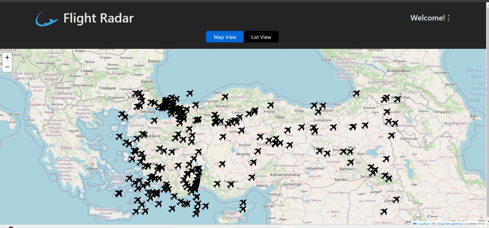

## Toolkit Radar App

This project is a web application for flight tracking. Users can access detailed information of the aircraft and view the flight route on the map.

### Libraries

- **leaflet**: Used for interactive map components.
- **react-leaflet**: React applications enable using Leaflet maps.
- **react-redux**: Provides Redux management of React applications.
- **@reduxjs/toolkit**: Provides a useful set of tools and development instructions for Redux.
- **axios**: Used to do what HTTP wants.
- **react-pagination**: Used for pagination operations.
- **thunk**: Used for asynchronous components in Redux. These are the ones offered in the Toolkit.

### Project gif

### Resources

- **API**: [Flight Radar API](https://rapidapi.com/apidojo/api/flight-radar1) is used for flight data in RapidAPI.
  This API provides real-time flight information and forms the basic parameters of this application.

### Contributing

- To contribute to this project, fork the GitHub repository and save it as you wish.
- Describe the change you made clearly and ensure proper code organization.
- Test your changes and create a pull request.
